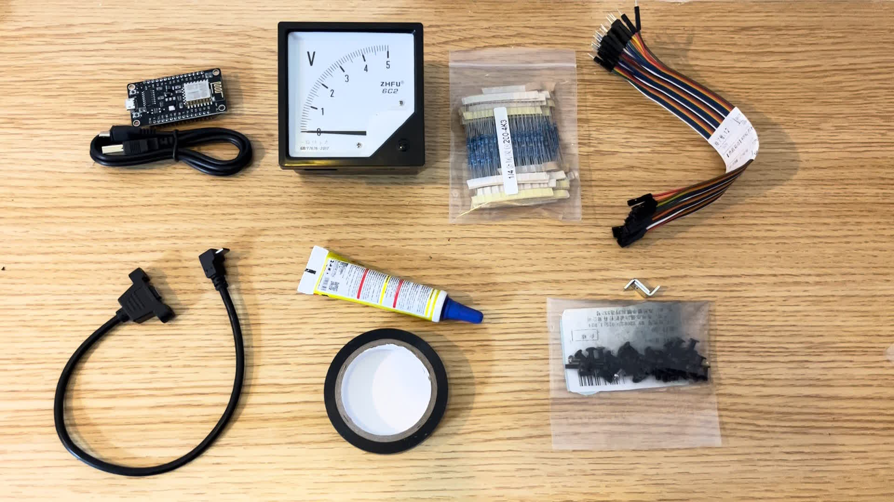
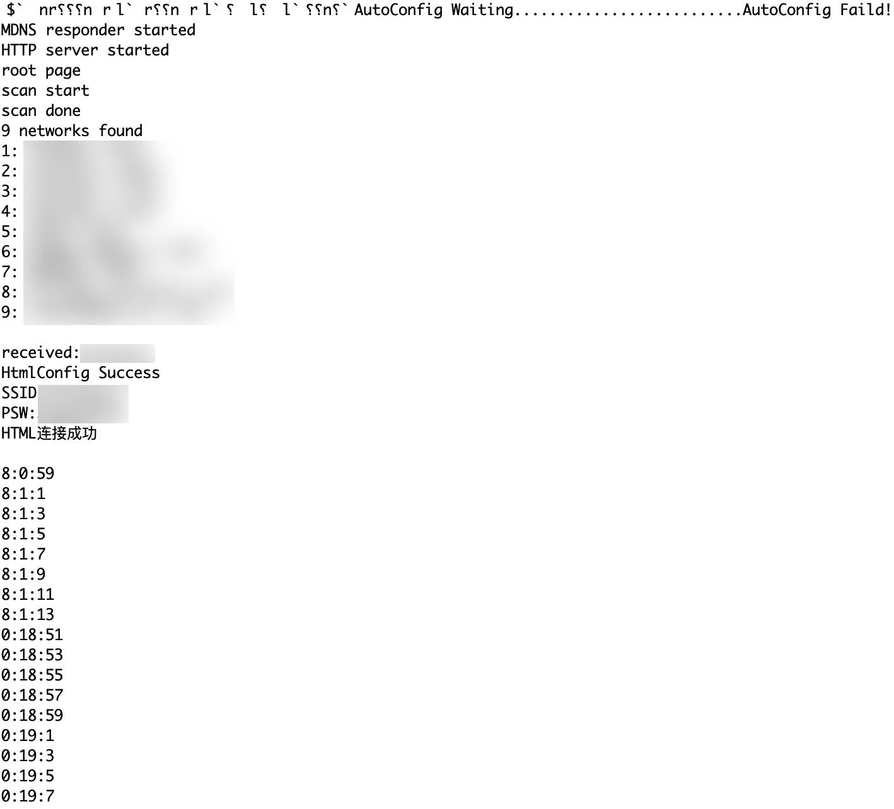
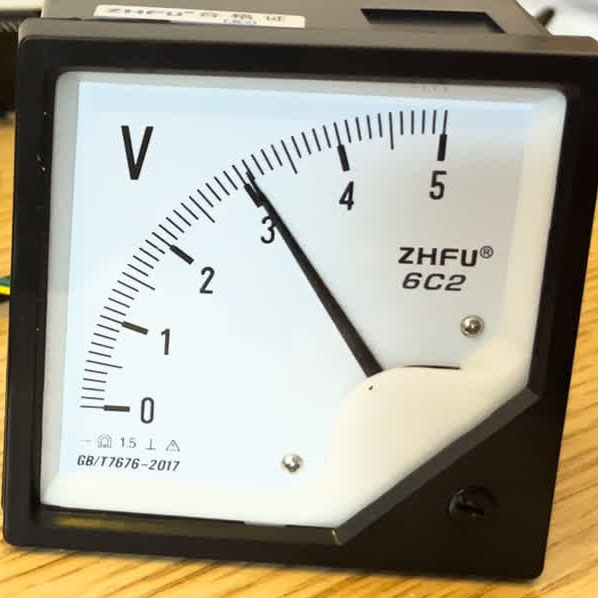
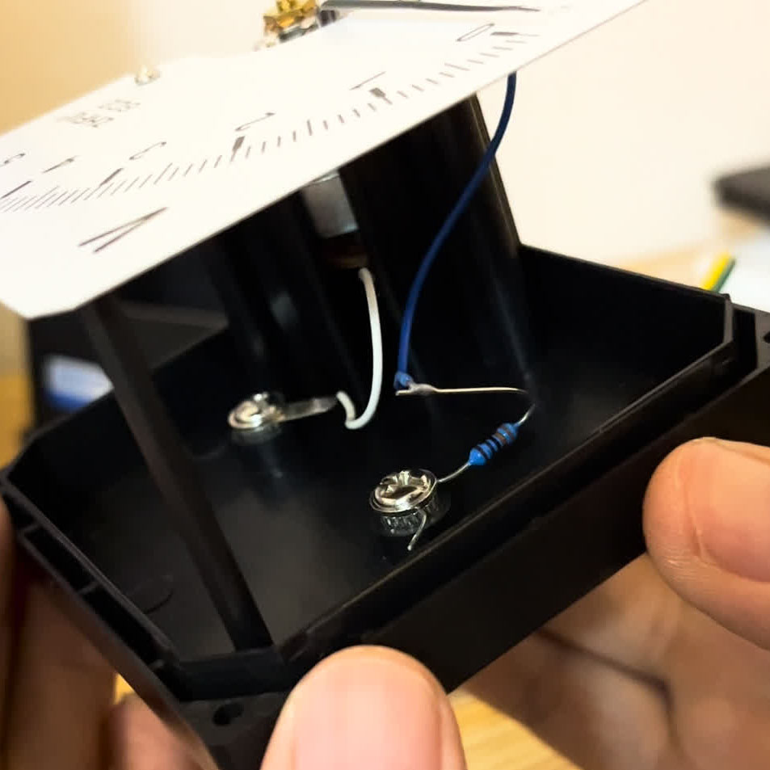
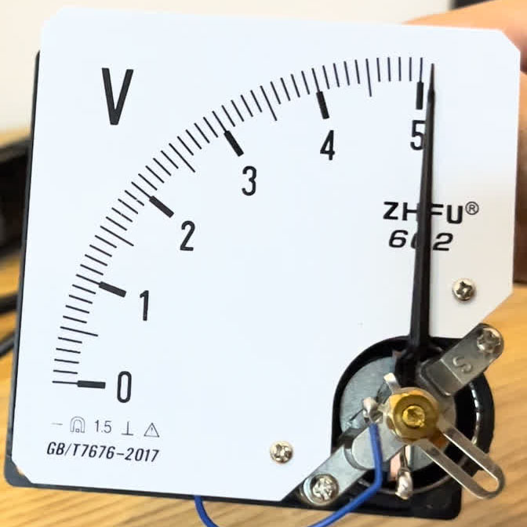
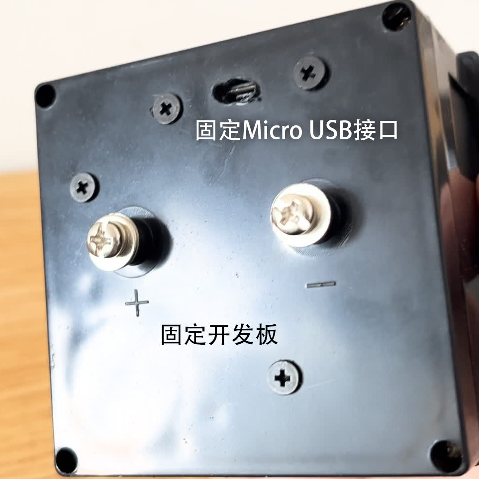
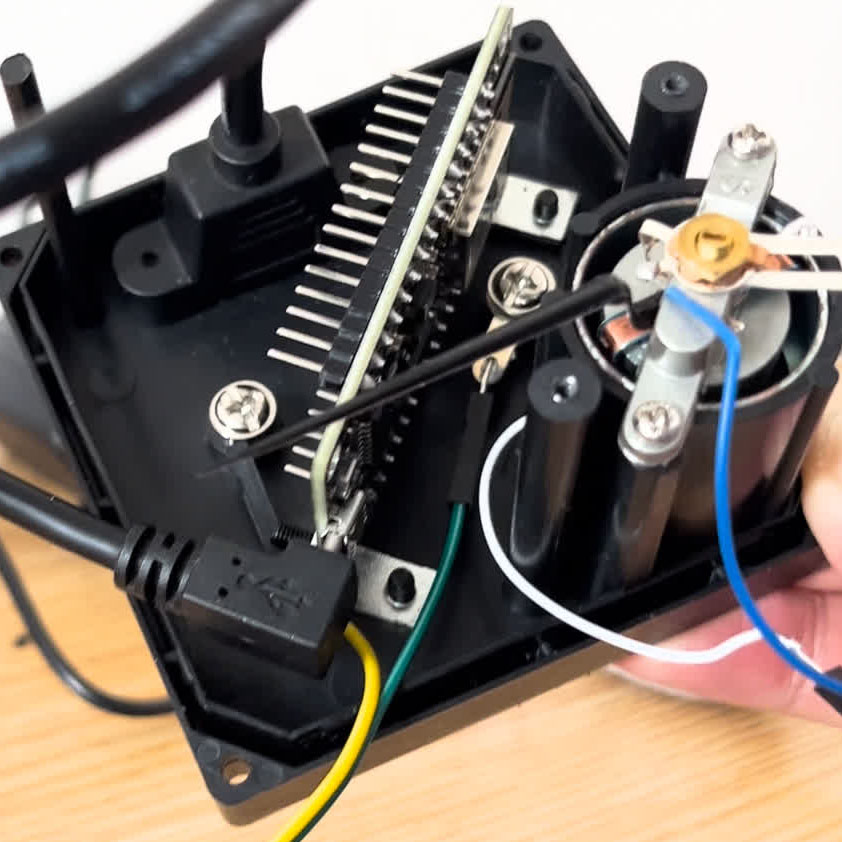
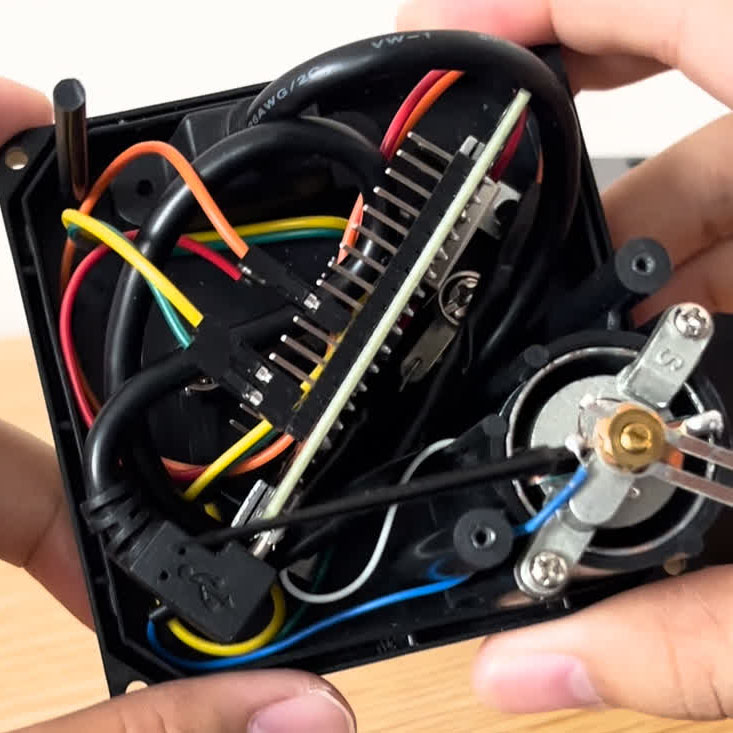

# TimeCube

## 材料

esp8266开发板、5v电压表（6C2型）、电阻、杜邦线、Micro USB延长线、绝缘胶带、胶水、角码、螺丝螺母

螺丝刀 手钻 电烙铁

## 获取网络时间

配网部分参考了[https://github.com/yuan910715/Esp8266_NTP_Clock_Weather](https://github.com/yuan910715/Esp8266_NTP_Clock_Weather)

开机后首先进入STA模式，通过wificonnect.h中的WIFI_STA,WIFI_PWD连接wifi，连接失败则进入AP模式，用电脑连接热点TimeCube，访问[http://192.168.4.1](http://192.168.4.1/)即可配网。联网成功后通过NTP获取时间。

烧写timetest即可从网络获取时间并经串口发出。

可以注意到，设置NTP服务器后，程序会在后台同步时间（如不能同步可以在configTime更换其他国内NTP服务器地址）。

## PWM控制电压表

选择具有PWM输出功能的GPIO口，连接电压表，调整metertest中的METER引脚为相应端口并烧入，可以看到指针匀速划过表盘，但不能划过整个表盘，这是因为ESP8266的工作电压是3.3v，小于电压表的最大值。

拆开电压表后可以看到电压表的结构为表头串联3.3k电阻，则调整量程至3.3v所需的电阻大小为

$$
\frac{3.3k\Omega}{5v}\times 3.3v\approx2.2k\Omega
$$

为保证指针可以达到满偏（如超过可以在程序中调整最大电压），这里选择阻值为2k的电阻。

最后在表盘黏贴新的刻度即完成了电流表的改装，表盘的设计可以参考panel.ai(panel.png)其中红色的部分需要裁去。

## 程序实现

表头时钟TimeCube程序是基于timetest与metertest实现的（如果在ntptest与metertest中调整了参数需要拷贝至TimeCube中），为增强可用性做了一些修改。

* 为防止指针突然运动，在惯性的作用下超出量程打弯指针，也是为了运行中的美观，程序不应突然改变电压。常规走时时，通过循环与延时逐渐改变；归零时（从11点59分到0点）先将电压降为0让指针加速回落，再在指针即将归零前升高电压令指针减速。停止部分的参数和电压表有关，需自行调整，手机的慢动作摄影可以帮助确认减速的时机。

* SSID和密码保存在EEPROM中，手动配网时更新保存的密码，重启后不需要重新配网。这一部分参考了[https://blog.csdn.net/qq_31878883/article/details/121452667](https://blog.csdn.net/qq_31878883/article/details/121452667https://blog.csdn.net/qq_31878883/article/details/121452667)
* NTP同步在后台运行，通过系统时间的大小判断是否同步成功（同步后时间在2020年后）。若当前时间正确，可在同步前先减去1.5768e9秒（50年），再判断系统时间。
* 配网时扫描指针。
* 为节省电能，时钟每六小时连接一次网络，通过WiFi.forceSleepBegin和WiFi.forceSleepWake实现。若连续7天未同步成功则重启。

## 组装

在背板上打孔固定micro usb延长线与esp8266开发板（开发板是纵向安放的，安装时用到了角码）

分别从接线柱和表头引线用于供电和指示

完成连线的效果如下，需注意用绝缘胶带覆盖裸露导线，用胶水固定连接处防止脱落

实现效果

